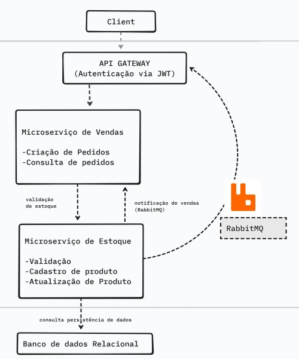
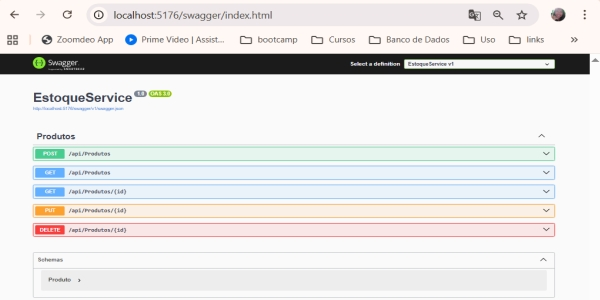
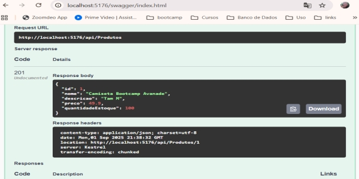

# Ecommerce-Microservices

*Bootcamp Avanade*

Aplicação com arquitetura de microserviços para gerenciamento de estoque de produtos e vendas em uma plataforma de e-commerce. O sistema será composto por dois microserviços: um para gerenciar o estoque de produtos e outro para gerenciar as vendas, com comunicação entre os serviços via API Gateway. 

Tecnologias: .NET Core, C#, Entity Framework, RESTful API, RabbitMQ (para comunicação entre microserviços), JWT (para autenticação) e banco de dados relacional.

Arquitetura Proposta 
Microserviço 1 (Gestão de Estoque): 
Responsável por cadastrar produtos, controlar o estoque e fornecer informações sobre a quantidade disponível. 

Microserviço 2 (Gestão de Vendas): 
Responsável por gerenciar os pedidos e interagir com o serviço de estoque para verificar a disponibilidade de produtos ao realizar uma venda. 

API Gateway: 
Roteamento das requisições para os microserviços adequados. Este serviço atua como o ponto de entrada para todas as chamadas de API. 

RabbitMQ: 
Usado para comunicação assíncrona entre os microserviços, como notificações de vendas que impactam o estoque. 

Autenticação com JWT: 
Garantir que somente usuários autenticados possam realizar ações de vendas ou consultar o estoque.

Funcionalidades Requeridas
Microserviço 1 (Gestão de Estoque): 

Cadastro de Produtos: Adicionar novos produtos com nome, descrição, preço e quantidade em estoque. 

Consulta de Produtos: Permitir que o usuário consulte o catálogo de produtos e a quantidade disponível em estoque. 

Atualização de Estoque: O estoque deve ser atualizado quando ocorrer uma venda (integração com o Microserviço de Vendas). 

Microserviço 2 (Gestão de Vendas): 

Criação de Pedidos: Permitir que o cliente faça um pedido de venda, com a validação do estoque antes de confirmar a compra. 

Consulta de Pedidos: Permitir que o usuário consulte o status dos pedidos realizados. 

Notificação de Venda: Quando um pedido for confirmado, o serviço de vendas deve notificar o serviço de estoque sobre a redução do estoque. 

Comum aos dois microserviços: 

Autenticação via JWT: Apenas usuários autenticados podem interagir com os sistemas de vendas ou consultar o estoque. 

API Gateway: Usar um gateway para centralizar o acesso à API, garantindo que as requisições sejam direcionadas ao microserviço correto

Contexto do Negócio
A aplicação simula um sistema para uma plataforma de e-commerce, onde empresas precisam gerenciar seu estoque de produtos e realizar vendas de forma eficiente. A solução deve ser escalável e robusta, com separação clara entre as responsabilidades de estoque e vendas, utilizando boas práticas de arquitetura de microserviços. Esse tipo de sistema é comum em empresas que buscam flexibilidade e alta disponibilidade em ambientes com grande volume de transações. 

Requisitos Técnicos
Tecnologia: .NET Core (C#) para construir as APIs. 

Banco de Dados: Usar Entity Framework com banco de dados relacional (SQL Server ou outro). 

Microserviços: 

Microserviço de Gestão de Estoque deve permitir cadastrar produtos, consultar estoque e atualizar quantidades. 

Microserviço de Gestão de Vendas deve validar a disponibilidade de produtos, criar pedidos e reduzir o estoque. 

Comunicação entre Microserviços: Usar RabbitMQ para comunicação assíncrona entre os microserviços, especialmente para notificar mudanças de estoque após uma venda. 

Autenticação: Implementar autenticação via JWT para proteger os endpoints e garantir que apenas usuários autorizados possam realizar ações. 

API Gateway: Usar um API Gateway para redirecionar as requisições de clientes para os microserviços corretos. 

Boas Práticas: Seguir boas práticas de design de API, como a utilização de RESTful APIs, tratamento adequado de exceções e validações de entrada. 

Critérios de Aceitação
O sistema deve permitir o cadastro de produtos no microserviço de estoque. 

O sistema deve permitir a criação de pedidos no microserviço de vendas, com validação de estoque antes de confirmar o pedido. 

A comunicação entre os microserviços deve ser feita de forma eficiente usando RabbitMQ para notificações de vendas e atualizações de estoque. 

O sistema deve ter uma API Gateway que direcione as requisições para os microserviços corretos. 

O sistema deve ser seguro, com autenticação via JWT para usuários e permissões específicas para cada ação. 

O código deve ser bem estruturado, com separação de responsabilidades e boas práticas de POO. 

Extras
Testes Unitários: Criar testes unitários para as funcionalidades principais, como cadastro de produtos e criação de pedidos. 

Monitoramento e Logs: Implementar monitoramento básico de logs para rastrear falhas e transações no sistema. 

Escalabilidade: O sistema deve ser capaz de escalar facilmente, caso seja necessário adicionar mais microserviços (ex: microserviço de pagamento ou de envio). 

---------------------------------------------

---------------------------------------------

Criação do projeto

Observação:
Este projeto utiliza SQLite como banco de dados local para facilitar testes e execução em qualquer ambiente. Caso necessário, pode ser facilmente adaptado para SQL Server Express.

1- No visual studio code:
   - No terminal: mkdir EcommerceMicroservices
                  cd EcommerceMicroservices

2- No terminal, criar microserviços e o gateway:
   - dotnet new webapi -n EstoqueService
   - dotnet new webapi -n VendasService
   - dotnet new webapi -n ApiGateway

3- Criar solution e depois no terminal adicionar cada projeto a solution:
   - dotnet sln add EstoqueService/EstoqueService.csproj
   - dotnet sln add VendasService/VendasService.csproj
   - dotnet sln add ApiGateway/ApiGateway.csproj

4- Criar endpoints para cadastrar, consultar, atualizar e deletar produtos via API RESTful:

5- Criar o banco de dados com EF Core.
   No terminal, execute os comandos para criar a migração e aplicar ao banco:

   - bash
   - dotnet ef migrations add InitialCreate
   - dotnet ef database update

Resultado Esperado:
Você terá uma API funcional com os seguintes endpoints:

POST /api/produtos → Criar produto

GET /api/produtos → Listar todos

GET /api/produtos/{id} → Consultar por ID

PUT /api/produtos/{id} → Atualizar

DELETE /api/produtos/{id} → Remover

6- No terminal, na pasta EstoqueService, rode dotnet run e veja o endereço para visualização do projeto
   Exemplos:
   - Endereço exato do terminal. Exemplo:  http://localhost:5176
   - Endereço fornecido no erminal + swagger.Exemplo:  http://localhost:5176/swagger

7- Ou verifique o endereço em crie launchSettings.json (com porta HTTPS), ou se não tiver, crie com o Conteúdo abaixo, dentro da pasta EstoqueService/Properties/launchSettings.json:
{
  "profiles": {
    "EstoqueService": {
      "commandName": "Project",
      "dotnetRunMessages": true,
      "applicationUrl": "https://localhost:5001;http://localhost:5000",
      "environmentVariables": {
        "ASPNETCORE_ENVIRONMENT": "Development"
      }
    }
  }
}

8- Rode no terminal dotnet run, veja o endereço e acrescente /swagger

9- no navegador, clique em POST /api/Produtos / Try it out
   - Cole este exemplo:
   {
   "nome": "Camiseta Bootcamp Avanade",
   "descricao": "Tam M",
   "preco": 49.90,
   "quantidadeEstoque": 100
   }

   - Clique em executar

   

   - Teste o GET /api/Produtos para listar todos os produtos
   - Teste o GET /api/Produtos/{id} para buscar um específico
   - Teste o PUT e o DELETE para atualizar e remover

   ------------------------------------------

   ## Testes de automação

1-Na pasta raiz do projeto, no terminal da ide, rodar: cd EstoqueService.Tests

2- No terminal, adicionar a referência ao projeto principal

dotnet add reference ../EstoqueService.csproj

3- Instalar pacotes para testes de integração
   No terminal, dentro da pasta EstoqueService.Tests, rode os seguintes comandos:

dotnet add package Microsoft.AspNetCore.Mvc.Testing
dotnet add package Microsoft.EntityFrameworkCore.InMemory

=> Esses pacotes vão permitir:

   - Simular chamadas reais à API sem subir o servidor

   - Usar um banco de dados em memória para os testes (sem afetar o estoque.db real)

4- Rode 
dotnet add package Microsoft.EntityFrameworkCore.InMemory

5- Criar teste para POST /api/Produtos

Passo 1: Crie o arquivo de teste
   
- Dentro da pasta EstoqueService.Tests, crie um arquivo chamado ProdutosControllerTests.cs.

6- Instalar o pacote Newtonsoft.Json
No terminal, dentro da pasta EstoqueService.Tests, rode:

dotnet add package Newtonsoft.Json

- Corrigir os using no arquivo ProdutosControllerTests.cs
Abra o arquivo e garanta que os using estejam assim:

using System.Net.Http;
using System.Text;
using System.Threading.Tasks;
using Xunit;
using Microsoft.AspNetCore.Mvc.Testing;
using Newtonsoft.Json;
using EstoqueService; // Isso importa o Program.cs

- Abra o EstoqueService/ Program.cs e adicionar no final dele:

public partial class Program { }

7- Passo 3: Rode os testes
No terminal, ainda dentro da pasta EstoqueService.Tests, execute:

dotnet test

   

 

